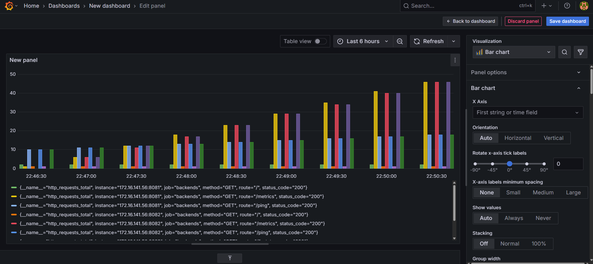
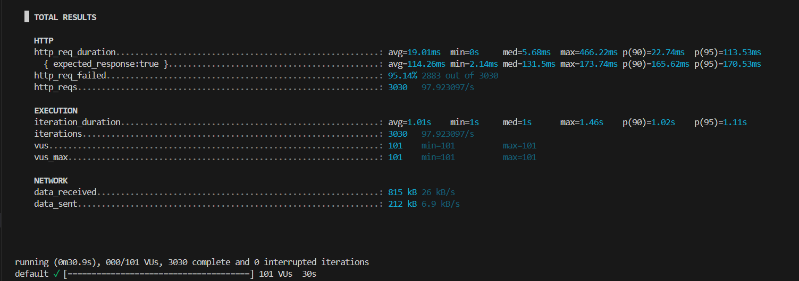

# NeuraBalancer: Intelligent Load Balancer with Prometheus + Grafana Monitoring

This project implements a self-healing, energy-aware, multi-cloud-ready load balancer with real-time monitoring (Prometheus + Grafana) and benchmarking (K6).

---

## 🔧 Features

- ⚙️ Intelligent traffic routing
- 🚦 Health checks and fault tolerance
- 📈 Real-time metrics via Prometheus + Grafana
- 🧪 Load testing using K6
- 🐳 Docker Compose-based setup

---


---

## 🚀 How to Use

By default, the load balancer expects 3 backend servers to be running on ports `8081`, `8082`, and `8083`.

### 🔧 Running Backend Servers:
```bash
npm run dev:be 8081
npm run dev:be 8082
npm run dev:be 8083
```

### 🧠 Running the Load Balancer:
```bash
npm run dev:lb 8000
```

Now, start sending requests to the load balancer at:  
🔗 `http://localhost:8000`

---

## 📊 Monitoring with Prometheus and Grafana

## 1. Start Monitoring Services:
```bash
docker-compose up -d prometheus grafana
```

### 2. Grafana Access:
---

## 📈 Prometheus Metrics

Check metrics at:

```bash
http://localhost:9091
```

Use queries like:

- `http_requests_total`
- `load_balancer_latency_seconds`

---

- Visit: [http://localhost:3000](http://localhost:3000)
- Login:
  - **Username**: `admin`
  - **Password**: `admin` (change after first login)
-Import Dashboard (Optional)
Click the "+" icon in the left menu → Import

Use any dashboard ID from Grafana Dashboards

For example: 1860 for a general Prometheus Node Exporter dashboard
- Explore dashboards to visualize metrics like:
  - Request count per server
  - Response times
  - Load distribution

📸 Example Dashboard Screenshot:


🛠️ Don’t forget to **change the IP addresses** in `prometheus.yml` `targets` section to your actual backend and load balancer IPs.

---

## 🧪 Load Testing using K6

### Run the K6 Test:
```bash
k6 run tests/test.js
```

This script simulates multiple users hitting the load balancer and helps visualize how traffic is handled.

📸 Example Load Test Output:


---

## ⚙️ Customizable Load Balancing Algorithms

The system supports modular plug-and-play for algorithms like:
- 🔁 Round Robin
- 📉 Least Connections
- 🎲 Random

You can add your own strategy by implementing a class in the `algorithms` folder and plugging it into the load balancer config.

---

## 🧪 Load Testing with K6

### Run a test:

```bash
k6 run test-load.js
```

You can modify `test-load.js` to increase VUs, duration, or endpoints.


## 🔍 Monitoring Load Balancer Health

Health checks are done every 5 seconds:

- Dead server = marked unhealthy
- Traffic is routed around it

---

## 📚 Methodology Summary

1. **Metrics Collection** via Prometheus
2. **Routing Decision** based on real-time stats and rules
3. **Performance Evaluation** using Grafana/K6